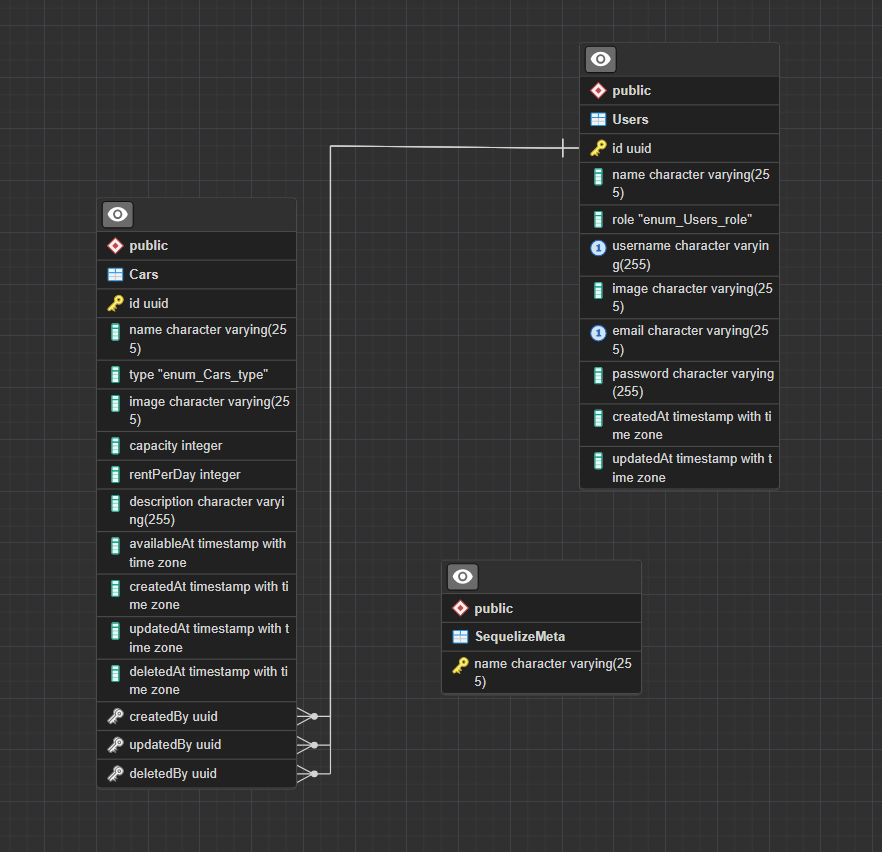

# Simple CRUD application for rental cars

All the documentation for the API can be found on [Swagger](https://api-rental-car.risalamin.com/docs).

The API is deployed on [https://api-rental-car.risalamin.com](https://api-rental-car.risalamin.com), you can hit the endpoints directly from there.

Here's the ERD for the database:

<p align='center'>
  
</p>

## Development

Here are the steps to run the project locally.

1. Clone the repository

   ```bash
   git clone https://github.com/ccrsxx/binar-backend.git
   ```

1. Change directory to the project

   ```bash
   cd binar-backend
   ```

1. Install dependencies

   ```bash
   npm i
   ```

1. Check your credentials on `.env.development`. Make sure you have the correct credentials for your PostgreSQL database. Or create `.env.local` so that it doesn't get tracked by git.

1. Create DB if not exists

   ```bash
   npm run db:create
   ```

1. Run migrations

   ```bash
   npm run db:migrate
   ```

1. Run seeders

   ```bash
   npm run db:seed
   ```

1. Run the app

   ```bash
   npm run dev
   ```
